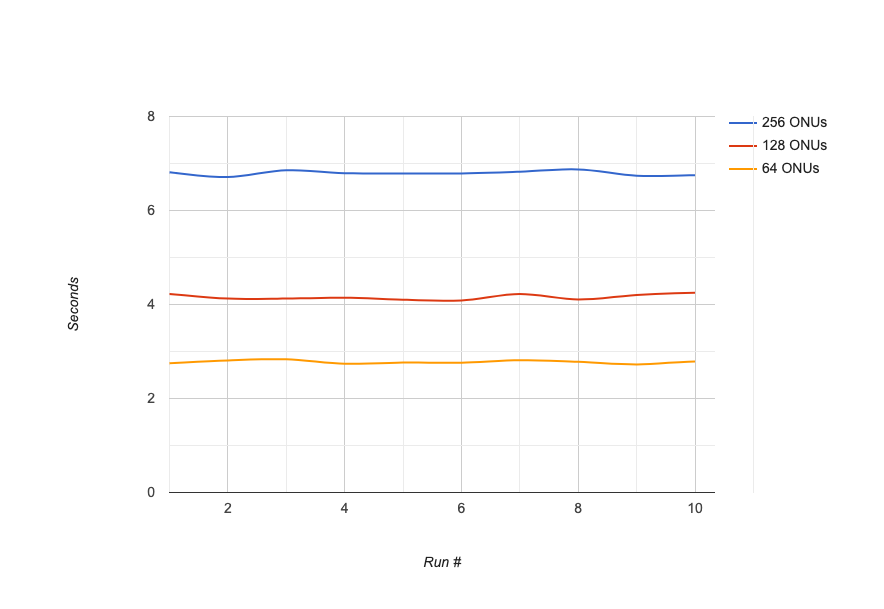

.. _BBSim Reflector:

BBSim Reflector
===============

BBR (a.k.a BBSim Reflector) is a tool designed to scale test BBSim. It
is responsible to emulate ONOS and VOLTHA in order to quickly reply to
any message that BBSim sends.

Here is a graph of the measurements of BBSim performance captured over
10 runs with different PON Layout

   BBSim Performances

Run BBR
-------

To run ``bbr`` you need to have a ``bbsim`` instance running.

You can start ``bbsim`` locally with:

.. code:: bash

   $ DOCKER_RUN_ARGS="-onu 16 -pon 4" make docker-run

Once ``bbsim`` is up and running you’ll see this on the console:

.. code:: bash

   docker run -p 50070:50070 -p 50060:50060 --privileged --rm --name bbsim """"bbsim:0.0.2-dev /app/bbsim -onu 16 -pon 4
   time="2019-10-18T00:24:46Z" level=info msg="BroadBand Simulator is on" NumNniPerOlt=1 NumOnuPerPon=16 NumPonPerOlt=4 OltID=0
   time="2019-10-18T00:24:46Z" level=debug msg=CreateOLT ID=0 NumNni=1 NumOnuPerPon=16 NumPon=4 module=OLT
   time="2019-10-18T00:24:46Z" level=info msg="Successfully activated DHCP Server" module=NNI
   time="2019-10-18T00:24:46Z" level=debug msg="Created OLT with id: 0"
   time="2019-10-18T00:24:46Z" level=debug msg="Started APIService"
   time="2019-10-18T00:24:46Z" level=debug msg="APIServer Listening on 0.0.0.0:50070"
   time="2019-10-18T00:24:46Z" level=debug msg="OLT Listening on 0.0.0.0:50060" module=OLT

At this point you can start ``bbr`` (note that you need to pass the same
number of ONUs and PON Ports to the two processes):

.. code:: bash

   $ ./bbr -onu 16 -pon 4

``bbr`` will run to completion and output the time it took to bring all
the ONUs to the ``dhcp_ack`` state. If the ``bbr`` process doesn't exit,
it means something went wrong.

Debugging and issue reporting
-----------------------------

If you are experiencing issues with ``bbr`` please capture: - ``bbr``
logs - ``bbsim`` logs - ``bbsimctl onu list`` output

You can use these commands to capture ``bbsim`` and ``bbr`` logs during
execution:

.. code:: bash

   $ DOCKER_RUN_ARGS="-onu 16 -pon 4" make docker-run 2>&1 | tee bbsim.logs

.. code:: bash

   $ ./bbr -onu 16 -pon 4 2>&1 | tee bbr.logs

And this command to retrieve the list of onus in the system (run this
command once ``bbr`` is hanging but before terminating ``bbsim``):

.. code:: bash

   docker exec bbsim bbsimctl onu list > onu.list
